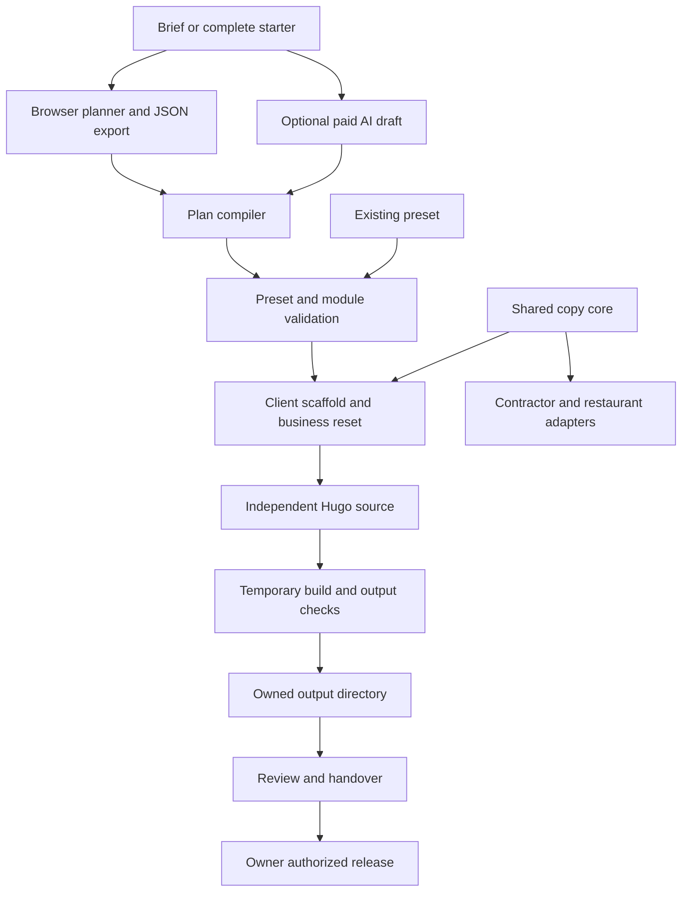

# Website Factory review and improvement proposals

Implementation follow-up: [remediation and verification status](remediation-2026-10-03.md). This review records the pre-remediation evidence; it is retained as history.

Reviewed October 3, 2026. Baseline: `main`, commit `24d9b70`, plus the five existing modified or untracked files described below. This is a review and proposal, not an implementation or release approval.

The Website Factory is a capable internal production system with a working static-site engine, a broad component library, useful agent interfaces, and unusually deliberate safeguards around client isolation and unsupported claims. It is not yet a cohesive tool a professional solo creator can confidently operate from beginning to end without knowing the implementation. The main work is to connect its existing capabilities, make readiness evidence reliable, and reduce the effort of editing and recovering work.

The recommended next milestone is one complete, repeatable solo workflow: choose a starter, edit it with minimal input, preview the actual result, resolve the small set of relevant issues, and prepare an independently usable client package. Keep Hugo, static output, local ownership, and explicit publication decisions. There is no demonstrated need for a framework rewrite, cloud accounts, a subscription platform, or a larger component catalog first.

This review contains **16 correction entries and 28 enhancement proposals**. They are a comprehensive inventory of material opportunities identified in this review, not a claim that every possible defect has been found. Proposed capabilities are not represented as implemented features.

## Current state and evidence

| Area | Current state | Assessment |
| --- | --- | --- |
| Site engine | Hugo Extended 0.166.0, Dart Sass 1.104.1, Python helpers, small browser scripts | Appropriate for lightweight, owned websites |
| Library | 31 module families, 62 variants, nine presets, six palettes, five font pairings | Broad enough for the next workflow milestone |
| Active profile | `258webco`, with Home, Services, Contact, Privacy, plus receipt and error routes | Configured reference storefront; live hosting was not inspected |
| Local release defaults | `example.invalid`, `noindex=true`, form disabled, endpoint intake disabled | Safe preview defaults |
| Planner | Browser-local projects, complete starters, structured content, ordered pages/sections, review state, undo, JSON backup/import, Markdown handoff | Functional low-fidelity workspace with substantial editing effort |
| Compiler | Planner/model plan to validated preset; stable routes and anchors; structured starter content preservation | Valuable bridge with schema and policy coupling to simplify |
| Client creation | Isolated, pruned source copy; approvals and hosting bindings reset; independent tools | Working baseline; client documentation and release checks need attention |
| AI | Anthropic structured drafting, optional brief-to-copy command, stand-in tests, recorded eval harness | Integration exists; live model quality and cost effectiveness remain unverified |
| Agent interface | 11 MCP tools and JSON diagnostics for several CLIs | Useful, but tool behavior and error handling are uneven |
| Operations | Manual production/preview workflows, KV inquiry storage, inquiry reader/exporter, read-only smoke checker | Some useful pieces; not a unified delivery or maintenance workflow |
| Acceptance evidence | Dated local records, latest current section September 29 | Historical evidence must remain tied to its tested state |

The doctor passed here: Python 3.14.7, Hugo Extended 0.166.0, Dart Sass 1.104.1, Node 22.22.3, Playwright browser, Anthropic 1.8.0, and Ruff. That does not cover the newly introduced vertical dependencies.

Fresh checks in this review:

- Factory configuration and generated schema freshness passed.
- Strict claims scan of the active master passed: six monetary matches across three exact statements recorded in `approved_claims`. This confirms the repository's recorded approval state; it does not independently establish business confirmation.
- Public and workshop builds, each in a temporary destination, passed their generated-output checks.
- Both new scaffold-core tests passed. All eight existing starter tests passed, including an isolated client build under a subpath.
- Generic client creation and second-generation copying succeeded.
- Restaurant vertical creation and second-generation copying succeeded. This was a scaffold/portability probe, not a restaurant build or acceptance review.
- Contractor creation failed because `yaml` is unavailable in the Python interpreter selected by the wrapper. No dependencies were installed to conceal this onboarding failure.
- Focused Chromium checks of the public Home, Contact, and planner landing page found no axe WCAG-tagged violations or page errors. Mobile overflow checks passed. Loading and saving the default starter succeeded in isolated browser storage.
- The opened default home-page editor exposed 49 form controls and 35 buttons. Its full-page screenshots were 9,067 pixels tall at a 1,366-pixel viewport and 11,864 pixels tall at a 390-pixel viewport. These are observed dimensions for this starter and viewport, not general performance benchmarks.
- `git diff --check` passed for the existing changes.

The browser probe did not rerun the complete workshop/variant suite. No full test suite, Lighthouse run, live AI request, real-device test, screen-reader session, live form submission, deployment, or external account inspection was performed. Browser launch initially failed under the execution sandbox; the focused probe completed outside that sandbox using temporary builds and an isolated profile. No existing planner storage was used.

Local review evidence is saved under [reports/project-review-2026-10-03](/Users/ryanjohnson/Projects/the-website-factory/reports/project-review-2026-10-03). That directory is ignored by Git. Source verification and focused probes establish the findings below; screenshot inspection establishes only the visual observations described.

## How the project works

The public website and the internal production tool share the same repository, but serve different audiences. The public site is the selected business profile. The workshop adds the planning workspace, component catalog, style guide, and fictional composition previews. Client sites are independent source copies, not records served dynamically by the master.

The important source boundaries are:

| Boundary | Main owners | What belongs there |
| --- | --- | --- |
| Content contract | [modules.json](/Users/ryanjohnson/Projects/the-website-factory/data/modules.json), [schemas.py](/Users/ryanjohnson/Projects/the-website-factory/scripts/schemas.py), [factory.py](/Users/ryanjohnson/Projects/the-website-factory/scripts/factory.py) | Types, required fields, variants, links, dependencies |
| Authored business content | `data/presets/`, `data/site.yaml`, `data/contact.yaml`, `content/` | Pages, identity, copy, forms, detail stories |
| Planning state | [workflow.js](/Users/ryanjohnson/Projects/the-website-factory/assets/js/workflow.js), [kit.html](/Users/ryanjohnson/Projects/the-website-factory/layouts/_default/kit.html) | Projects, editing, review, persistence, exports |
| Compilation | [from_plan.py](/Users/ryanjohnson/Projects/the-website-factory/scripts/from_plan.py) | Normalize a plan into renderer data without inventing facts |
| Scaffolding | [new_site.py](/Users/ryanjohnson/Projects/the-website-factory/scripts/new_site.py), [scaffold_core.py](/Users/ryanjohnson/Projects/the-website-factory/scripts/scaffold_core.py) | Copy sources, reset business-specific state, select resources |
| Rendering | `layouts/`, `assets/scss/`, [build.py](/Users/ryanjohnson/Projects/the-website-factory/scripts/build.py) | Render selected content and safely reconcile owned output |
| Evidence | [claims.py](/Users/ryanjohnson/Projects/the-website-factory/scripts/claims.py), [check_site.py](/Users/ryanjohnson/Projects/the-website-factory/scripts/check_site.py), [handover.py](/Users/ryanjohnson/Projects/the-website-factory/scripts/handover.py), browser scripts | Findings and the precise scope of verification |
| Delivery | `functions/`, `wrangler.toml`, `.github/workflows/`, [enquiries.py](/Users/ryanjohnson/Projects/the-website-factory/scripts/enquiries.py) | Intake, hosting configuration, publication, inquiry operations |

This is a sensible overall architecture. Its maintenance cost comes from overlapping representations and policies: browser validation, model-plan schema, relaxed planner imports, preset schema, Python semantic rules, Hugo checks, output checks, claims checks, and handover rules. Some duplication is justified defense in depth. The problem is disagreement between those layers about scope, state, and readiness.

## Corrections to prioritize

Priority P1 means fix before relying on the affected professional delivery workflow. P2 means a material correctness, usability, or maintenance issue. P3 means cleanup. Evidence is marked as reproduced, source-confirmed, or an unresolved risk. Sizes describe scope: S is a focused change, M a bounded feature, L a multi-part change. They are not delivery estimates.

### F01 Claims coverage differs across interfaces

**P1 · Reproduced · S.** The CLI calls `claims.find(preset, root=ROOT)`. Handover and MCP omit the root. A temporary client with an unapproved `$999 website` choice produced one whole-site finding, but its handover report said zero open claims and ready for owner review. The master's MCP claims tool also returned zero findings while the CLI reported six approved matches.

**Solution:** expose explicit preset-only and whole-site checks, with scope in the result. Handover and a slug-based site check should include site data and retained Markdown. An unsaved preset can remain preset-only, clearly labeled. Update post-scaffold plan review to use the created client's source.

**Acceptance:** CLI, MCP, and handover agree on a fixture containing claims in the preset, contact settings, and a retained detail page. [handover.py:57](/Users/ryanjohnson/Projects/the-website-factory/scripts/handover.py:57), [mcp_server.py:86](/Users/ryanjohnson/Projects/the-website-factory/scripts/mcp_server.py:86).

### F02 Normal client builds do not enforce claim approval

**P1 · Reproduced · M.** An indexable temporary client build succeeded with that unapproved `$999` price. The build checks output and placeholder text, but does not run strict claims checking. The generated client's `npm test` runs `claims.py` without `--strict`, so findings do not fail that command either. The master's separate verification workflow does run strict claims; this gap concerns direct builds and the client workflow.

**Solution:** define one release-readiness operation and require it for indexable/release builds. Keep preview builds permissive enough to work with drafts. Include whole-site claims, placeholder identity/contact checks, selected integrations, and an explicit approved-content state.

**Acceptance:** a draft preview builds; the corresponding release fails with field-level findings until facts are confirmed. [build.py:233](/Users/ryanjohnson/Projects/the-website-factory/scripts/build.py:233), [new_site.py:20](/Users/ryanjohnson/Projects/the-website-factory/scripts/new_site.py:20).

### F03 Handover can report on stale output as if it matched current source

**P1 · Reproduced · M.** After building a temporary client, changing its hero title without rebuilding still yielded ready for owner review. The generated HTML lacked the new title. Handover hashes the output manifest and reads the current revision independently, but does not prove those describe the same source state. It also reports file defaults rather than a complete record of effective build overrides.

**Solution:** record input hashes, effective settings, preset/schema versions, tool versions, build arguments, and output hashes in a build receipt. Make readiness refuse stale or unidentified output. A report may still describe stale output, but must label it as such.

**Acceptance:** editing any relevant content/configuration invalidates readiness; a rebuild restores a matched receipt. [handover.py:49](/Users/ryanjohnson/Projects/the-website-factory/scripts/handover.py:49).

### F04 Important tests are outside the normal gates

**P1 for the new scaffold change · Source-confirmed · S.** `test_scaffold_core.py` is absent from `npm test`, and therefore from the shared verification gates. CI's browser step omits `check_planner_fidelity.cjs`, although the README says all browser checks run. Passing CI would not exercise these two contracts.

**Solution:** add the new unit test and the browser fidelity check to the appropriate gate lists, keeping local targeted commands available. Derive documentation from one check manifest where practical.

**Acceptance:** deliberately breaking each contract makes its advertised gate fail. [package.json:17](/Users/ryanjohnson/Projects/the-website-factory/package.json:17), [deploy.yml:83](/Users/ryanjohnson/Projects/the-website-factory/.github/workflows/deploy.yml:83).

### F05 The new contractor entry point has an undisclosed dependency

**P2 · Reproduced · S.** The documented factory command invokes the contractor adapter using `sys.executable`; that adapter imports PyYAML. The current factory environment lacks it, and the command fails with a traceback even though the factory doctor is green. The new README identifies the sibling checkout dependency, but not this interpreter dependency.

**Solution:** add a vertical manifest with required source version, interpreter/dependencies, supported presets, and its verification command. Preflight before copying and print one actionable fix. Normalize `~` paths consistently with generic setup.

**Acceptance:** missing dependencies fail before output exists, with the specific environment/setup instruction; supported setups create the contractor copy. [vertical_site.py:21](/Users/ryanjohnson/Projects/the-website-factory/scripts/vertical_site.py:21).

### F06 Invalid MCP input can bypass useful diagnostics or terminate the server

**P2 · Reproduced · S.** A preset with a list-valued module field reaches semantic validation despite schema errors and raises `TypeError`. The MCP wrapper turns that into a generic unexpected-error result. Separately, string-valued JSON-RPC `params` raises `AttributeError` outside the tool error boundary; the main loop does not recover.

**Solution:** validate the request envelope before dispatch; return schema diagnostics before unsafe semantic traversal; reject malformed input without ending the server. Apply shape validation consistently to CLI-loaded presets too.

**Acceptance:** malformed requests return field-level or protocol errors, and a subsequent valid request succeeds in the same session. [mcp_server.py:78](/Users/ryanjohnson/Projects/the-website-factory/scripts/mcp_server.py:78), [mcp_server.py:147](/Users/ryanjohnson/Projects/the-website-factory/scripts/mcp_server.py:147).

### F07 The MCP client-creation result overstates what happened

**P2 · Source-confirmed · S.** The tool description says it creates and then builds a client. The plan branch builds; the preset branch only calls `new_site.create()` and returns `ok: true`. An agent cannot treat these equivalent successful responses as equivalent evidence.

**Solution:** make behavior consistent, or return explicit `created`, `validated`, `built`, and `checked` states with evidence paths and accurately describe each branch.

**Acceptance:** callers can distinguish a source-only copy from a built and checked preview without reading server code. [mcp_server.py:104](/Users/ryanjohnson/Projects/the-website-factory/scripts/mcp_server.py:104).

### F08 Dynamic contact responses lack the advertised security headers

**P2 · Local response reproduced; platform behavior verified · S.** A no-JavaScript error response carries only content type and cache control. Its comment says the static CSP still applies. Cloudflare documents that `_headers` rules do not apply to responses generated by Pages Functions.

**Solution:** give dynamic HTML/JSON/redirect/error responses an explicit shared header policy; check it in endpoint tests. Keep static-asset handling distinct. This is not a demonstrated injection vulnerability: the error message is HTML-escaped.

**Acceptance:** all response paths carry the intended headers in local integration and a subsequent authorized hosted check. [contact.js:8](/Users/ryanjohnson/Projects/the-website-factory/functions/api/contact.js:8), [Cloudflare header documentation](https://developers.cloudflare.com/pages/configuration/headers/).

### F09 Form recovery and notification timing work against the visitor

**P2 · Source-confirmed · M.** The browser discards the server's useful error reason and displays a connection message for validation errors, closed intake, and rate limits. A stored inquiry can also wait up to ten seconds for a notification webhook before receiving acknowledgment. Retrying an uncertain submission can create another inquiry.

**Solution:** return stable error codes and accessible, specific recovery text. Once durable storage succeeds, schedule optional notification with `context.waitUntil`; retain synchronous success requirements when a webhook is the only delivery destination. Add an idempotency mechanism and distinguish stored, notified, and notification-failed states.

**Acceptance:** wrong input, closed intake, rate limits, slow alerts, and retries each produce the intended visitor outcome without losing entered copy. [contact.js](/Users/ryanjohnson/Projects/the-website-factory/assets/js/contact.js), [endpoint:139](/Users/ryanjohnson/Projects/the-website-factory/functions/api/contact.js:139), [Cloudflare API reference](https://developers.cloudflare.com/pages/functions/api-reference/).

### F10 Client documentation describes capabilities removed from the client

**P2 · Source-confirmed · M.** A generated client receives the master's README plus a banner and several master guides, despite losing workshop routes, other presets, the new vertical launcher, and many tests. The new shared-scaffold section therefore advertises a command deliberately removed from that same copy. The convenience `go.sh` launcher and agent rules are not part of the copied file list.

**Solution:** generate a concise client README and agent instruction file from a capability manifest. Include only valid commands, the selected profile, editing locations, backup/build/review instructions, and client-specific hosting setup. Provide a portable short launcher where supported.

**Acceptance:** every command and local documentation link in a fresh client resolves and performs the advertised operation. [new_site.py:12](/Users/ryanjohnson/Projects/the-website-factory/scripts/new_site.py:12), [new_site.py:149](/Users/ryanjohnson/Projects/the-website-factory/scripts/new_site.py:149).

### F11 Content and documentation still have competing authorities

**P2 · Source-confirmed · M.** Descriptions exist in the preset, site data, and page front matter. Client creation synchronizes some of them once, but subsequent direct preset edits do not automatically synchronize front matter. The active master already contains different Home descriptions. There are also 30-versus-31 module references, a September 29 current acceptance section predating the current patch, and older review items that are now fixed.

**Solution:** resolve metadata from one authored source; derive copies only as build artifacts. Generate capability counts. Add a short documentation map and move historical briefs/reviews into an explicitly historical group. Preserve historical evidence without presenting it as current acceptance.

**Acceptance:** changing a page description changes its rendered metadata, social metadata, and machine-readable map consistently; current docs report counts from the registry.

### F12 The roadmap overstates accessibility evidence

**P2 · Source-confirmed · S.** The roadmap says WCAG A/AA compliance was verified through automated axe checks. The acceptance guide correctly states the limits of those checks. These statements should agree. Automated tools cannot establish every accessibility requirement, as W3C's evaluation guidance explains.

**Solution:** replace conformance language with the measured check, routes/states, tool version, and date. Keep a bounded set of human/assistive-technology checks for relevant journeys. Avoid turning every generated section into another manual audit obligation.

**Acceptance:** all user-facing readiness and documentation language distinguishes automated findings, operator review, and actual conformance evaluation. [roadmap.md:25](/Users/ryanjohnson/Projects/the-website-factory/roadmap.md:25), [W3C evaluation guidance](https://www.w3.org/WAI/test-evaluate/tools/).

### F13 Output locking needs a portability and ordering correction

**P2 · Missing-module behavior reproduced; concurrency risk source-confirmed · M.** `publish_output()` imports Unix `fcntl` without an `ImportError` fallback. Simulating its absence raises `ModuleNotFoundError`; native Windows was not tested. The function also reads the old manifest, checks conflicts, and deletes temporary leftovers before acquiring the lock. Two overlapping builds can therefore make decisions from different or stale destination state. Some non-contention lock errors are silently ignored.

**Solution:** use an explicit supported-platform lock abstraction, acquire it before inspecting/mutating destination state, and fail closed on lock errors. Re-read the manifest under the lock. Preserve the existing ownership/conflict protections.

**Acceptance:** missing-platform support produces a clear preflight error or supported fallback; an interleaved-build regression verifies that the second build cannot publish from a stale snapshot. [build.py:29](/Users/ryanjohnson/Projects/the-website-factory/scripts/build.py:29), [build.py:78](/Users/ryanjohnson/Projects/the-website-factory/scripts/build.py:78).

### F14 Business-site assumptions prevent important creator use cases

**P2 · Source-confirmed; outbound rejection reproduced · M.** Validation requires Home, Contact, and a services module; each page must begin with a hero. Contact UI is always appended on the Contact page and asks for project type and budget. External HTTPS CTA destinations are rejected. These rules prevent straightforward one-page portfolios, newsletter signup destinations, booking links, donation links, and other common creator workflows.

**Solution:** separate document invariants from profile-specific business requirements. Add explicit page and contact modes, and safely validated outbound navigation links. Keep the ban on externally loaded scripts/fonts/assets as a separate policy.

**Acceptance:** a one-page creator portfolio with an approved external next step validates without inventing services or adding an irrelevant inquiry form. [factory.py](/Users/ryanjohnson/Projects/the-website-factory/scripts/factory.py), [from_plan.py:132](/Users/ryanjohnson/Projects/the-website-factory/scripts/from_plan.py:132), [compose.html](/Users/ryanjohnson/Projects/the-website-factory/layouts/partials/factory/compose.html).

### F15 The truthfulness contract exceeds the claims checker's actual coverage

**P2 · Source-confirmed · M.** Claims detection is a useful heuristic, not fact verification. It does not reliably cover worded durations, geography, identities, hours, all credentials, or every rendered template string. Exact-text approval also lacks provenance. The active preset retains unused fictional team/testimonial/area/resource sections; they are not currently rendered, but can be reintroduced through composition edits.

**Solution:** label claim-scanner scope explicitly, remove or isolate unused demo content from the active business profile, and add a lightweight fact/asset ledger for consequential facts. Show new or changed facts for review rather than repeatedly asking for every unchanged statement.

**Acceptance:** known facts have attributable sources; altered facts revoke their approval; demo content cannot become release content merely by selecting a section. [claims.py:119](/Users/ryanjohnson/Projects/the-website-factory/scripts/claims.py:119), [258webco.json](/Users/ryanjohnson/Projects/the-website-factory/data/presets/258webco.json).

### F16 Smoke checks do not prove release identity and are not a deployment gate

**P2 · Source-confirmed · M.** The new smoke checker tests useful HTTP behavior, but does not compare a deployed release/source identifier with the intended build. A prior release with matching headers, canonical URL, and form state could pass. The production workflow ends at the upload step and does not invoke the smoke checker. Its current wording is stronger than what it proves.

**Solution:** expose a deliberately public, non-sensitive release identifier distinct from the private build inventory. Compare it after upload, and report unreachable/mismatched states clearly. Do not silently roll back or change domains without delegated authority.

**Acceptance:** a previous otherwise healthy deployment fails the expected-release check; failed post-deploy verification produces an actionable report. [smoke.py](/Users/ryanjohnson/Projects/the-website-factory/scripts/smoke.py), [deploy.yml](/Users/ryanjohnson/Projects/the-website-factory/.github/workflows/deploy.yml).

## Deep review of the existing Git changes

At the beginning of the review, two tracked files were modified and three files were untracked. Nothing was staged. This review did not change those five files.

| File | Existing change | Review judgment |
| --- | --- | --- |
| `README.md` | Adds shared scaffold ownership, vertical commands, frozen-copy receipt explanation | Direction is clear; add dependency details and remove this master-only guidance from generated client READMEs |
| `scripts/new_site.py` | Replaces its local copy loop with `copy_sources()` and removes `vertical_site.py` from client copies | Small integration surface, but central to CLI, guided setup, AI-run and MCP creation; eight starter tests pass |
| `scripts/scaffold_core.py` | Shared allowlist copy, exclusions, symlink/traversal rejection, exclusive destination creation, rollback, embedded implementation, receipt | Good consolidation boundary; do not expand it into business-specific content policy |
| `scripts/test_scaffold_core.py` | Two focused tests for portability/exclusion/existing output and symlink/traversal refusal | Both pass; missing standard-gate wiring and several failure-path cases |
| `scripts/vertical_site.py` | Dispatches to sibling contractor or restaurant sculpt scripts | Restaurant path worked; contractor failed on PyYAML; version/dependency discovery is still implicit |

The new core gets several difficult things right: it rejects invalid source references before creating output, does not overwrite an existing destination, copies only named roots, strips common environment/dependency/generated artifacts, embeds its own implementation, and rolls back a destination it created if the copy phase fails. The generic adapter still resets identity, approvals, hosting bindings, and intake. Those responsibilities should remain with adapters.

The source receipt's SHA-256 identifies **the copy implementation**, not the full master tree or all delivered content. `source_kind` is the source directory name, which is not a stable identity. `approval_inherited: false` is a declaration in the receipt; the core itself does not inspect business approvals. The current generic reset is real, but a receipt must not be treated as proof that every future adapter performed its reset.

Before accepting this patch as complete:

1. Wire the new tests into the standard gate and add tests for copy failure rollback, receipt-write failure, wrong source types, duplicate/overlapping entries, missing parents, excluded environment variants, and standalone second-generation copying. These tests protect recovery and isolation rather than mirror each line of implementation.
2. Add vertical preflight and document the interpreter/dependency contract. Report which adapter and core version actually ran.
3. Add an adapter-level transaction or explicit recoverable failure state around copying plus neutralization. The shared core only rolls back its own copy phase. The inspected sibling adapters perform reset work after that call without a matching transaction around the whole operation.
4. Make each adapter return a verification receipt for reset invariants. Check the actual output for inherited approvals, active delivery, contact destinations, and master-specific identifiers; do not infer success from the core's receipt field.
5. Extend provenance with stable template/adapter ID, source revision or source-tree digest, selected profile, relevant contract versions, and a privacy-safe creation receipt. Keep frozen copies independent and make updates deliberate.
6. Verify the three repositories as one compatible integration set when the sibling changes are ready. This repository's CI cannot prove that an arbitrary sibling checkout will implement the expected contract.

GitNexus indexed the current HEAD, but reported stale runtime/index state; hashing its recorded files confirmed the two tracked working-tree changes and the absence of the three new files. Its change analysis reported high risk and six affected execution flows. Its `create()` impact analysis reported HIGH risk, direct creation callers including `factory_run.run`, `mcp_server.create_client_site`, and the setup entry points, plus an unresolved receiver call site. This was treated as incomplete evidence. No reindex was run, and the new files were reviewed directly. No graph result is presented as an all-clear.

Recommendation on the existing patch: **keep the design, request completion of its test/dependency/adapter contract before calling the consolidation finished.** The generic path has positive regression evidence. The contractor path is not currently runnable in the standard factory environment used for this review.

## Enhancement catalog for professional solo creators

These proposals build on the corrections. Each has an observable finish condition. Start with the P1 entries that reduce effort and make evidence dependable; later entries expand the supported work deliberately.

| ID | Priority and scope | Opportunity and proposed solution | Finish condition |
| --- | --- | --- | --- |
| E01 | P1 · M | **One short entry point.** Add a `wf` command with `new`, `open`, `check`, `status`, `backup`, and `handover`. Reuse existing functions; support lettered choices and saved defaults. | A fresh client can be created and resumed without remembering script names or retyping paths. |
| E02 | P1 · M | **Actionable project status.** Show current project, last save, build freshness, unresolved facts, failed checks, and the next useful action in one view. | The operator can identify what is blocked and why without reading several reports. |
| E03 | P1 · M | **Preview the actual draft.** Connect the planner to a local build/open flow, with the preview tied to a specific saved revision. Start with a separate preview window or screenshots. | Editing a section can lead directly to the matching rendered page without manual export/copy commands. |
| E04 | P1 · M | **Reduce editor length and fatigue.** Use a page outline and one expanded section at a time; group optional fields; keep location and save status visible. Preserve keyboard and voice discoverability. | The default starter can be edited without traversing the observed 49 controls on one long page. |
| E05 | P1 · M | **Typed content controls.** Generate item cards, add/remove/reorder actions, variant pickers, action destinations, and image selectors from the module contract. Today structured leaves become generic textareas and list cardinality has no dedicated editor. | A user can add one service, replace an image, or switch a supported variant without editing JSON. |
| E06 | P1 · M | **Durable local projects and backups.** Retain browser use, but add explicit file-backed project save/open through an optional local bridge, backup history, export freshness, and a recovery screen. | A project survives browser-origin changes and a tested restore without repeated manual copying. |
| E07 | P2 · M | **Less noisy saving and undo.** Save on sensible edit boundaries, announce meaningful save state changes, and group dictation/typing into useful undo units. Add redo and named checkpoints. | One dictated paragraph can be undone as a paragraph; saving does not announce every keystroke. |
| E08 | P1 · M | **A bounded review queue.** Present only new/changed issues with exact fields and relevant checks. Remember confirmed unchanged facts and component evidence. | Updating one section does not recreate a manual audit of an entire unchanged site. |
| E09 | P1 · M | **Revision-bound review and sign-off.** Record the reviewed source/build digest, approval scope, author, date, and unresolved decisions; invalidate only affected approvals. | Editing approved copy visibly returns the affected material to review and preserves unrelated evidence. |
| E10 | P2 · M | **Creator-oriented starters.** After F14, add a small set: portfolio, writer/newsletter, audio or art project, workshop/event, and a simple service creator. | Each starter supports a real end-to-end visitor goal with suitable pages and contact mode. |
| E11 | P2 · M | **Flexible contact intent.** Define form schemas and labels from data, with inquiry, email-only, booking-link, signup-link, and disabled-preview modes. Generate frontend/backend constraints from one contract. | Restaurant, consultant, nonprofit, and creator flows no longer inherit agency budget questions. |
| E12 | P2 · M | **Asset management and rights.** Add local import, supported-format checks, responsive processing, alt/decorative intent, usage references, and license/source records. | A replaced asset is optimized, traceable, and checked for every retained reference. |
| E13 | P2 · M | **Distinct visual identities.** Support real logo/wordmark/favicon replacement, controlled spacing and type scales, theme previews, and removable decorative artwork. | A creator's site no longer retains the factory mark or demo-specific social artwork unintentionally. |
| E14 | P2 · M | **Language support.** Drive the HTML language and interface strings from configuration; add locale-aware content fields, fonts with required glyph coverage, and optional translated pages. | A supported non-English site has correct language markup, controls, metadata, and tested text rendering. |
| E15 | P2 · M | **Practical SEO and sharing.** Add editable SEO titles separate from navigation labels, per-page social images, redirects, and structured data derived from confirmed business facts. Treat title lengths as guidance where appropriate. | Renaming a page can preserve its route and redirect history while updating metadata consistently. |
| E16 | P1 · M | **Fact and asset provenance.** Replace anonymous approval strings over time with lightweight records tied to content IDs and source evidence. Distinguish sample, supplied, confirmed, expired, and derived facts. | A reviewer can see why a claim appears and what change would require reconfirmation. |
| E17 | P2 · M | **Maintainable planner and engine modules.** Split dense browser code into state, persistence, commands, validation, and views; separate Python content, build, scaffold, and report services. Keep adapters thin. | A persistence fix or new module can be reviewed without changing unrelated rendering/policy logic. |
| E18 | P2 · M | **One module contract.** Extend the registry with field types, limits, labels, supported action kinds, and editor hints; derive browser controls, schemas, and docs from it. | Adding a field does not require manually reconciling multiple independent field lists. |
| E19 | P2 · M | **Versioned data and migrations.** Give planner exports, presets, modules, and vertical adapters explicit versions and compatibility checks. Pin schema identity to versions rather than mutable `main`. | An old project opens through a named migration or a clear, non-destructive unsupported-version result. |
| E20 | P2 · S/M | **Shared configuration parsing.** Replace scattered TOML/YAML regex readers with a supported parser or generated normalized settings artifact. Choose and document the Python floor deliberately. | Build, doctor, report, browser checks, and release tools resolve identical effective settings. |
| E21 | P2 · M | **Complete machine contracts.** Give MCP tools accurate side-effect annotations, output schemas, error codes, scope, and evidence references. Add read resources and a small number of reusable workflows if useful. | An agent can discover, execute, and interpret a workflow without guessing what `ok` means. |
| E22 | P1 · M | **Bounded AI drafting and repair.** Check destination/dependencies before spending; expose model and maximum effort/output budgets; save the original result before later steps; allow a small repair limit. Reject oversized results instead of silently slicing text/pages. | A failed copy/build can resume from the paid draft without another paid request or lost content. |
| E23 | P2 · M | **Representative AI evaluation.** Expand the three-brief/one-recording baseline with known facts, missing facts, adversarial content, unsupported claims, long content, and creator briefs. Report coverage, repetitions, costs, and individual failures. | Results distinguish schema validity, fact grounding, usefulness, and rendering; missing fixtures cannot appear as complete coverage. |
| E24 | P1 · M | **Independent client delivery package.** Generate client-specific docs, agent rules, check commands, capability manifest, optional CI configuration, and a review receipt. Include a clear owner-controlled publication step. | A fresh copy can be understood, checked, and maintained without the factory checkout or institutional knowledge. |
| E25 | P2 · M | **Client maintenance inventory.** Record each delivered site's template/core version, local source location, optional deployment identity, patch applicability, and last verified state. Propose updates as reviewable diffs. | A template fix identifies affected clients without silently rewriting their customizations. |
| E26 | P2 · M | **Inquiry operations.** Add deliberate deletion of selected records, export completeness/error reporting, notification health, and retention information for secondary copies. Keep credentials out of client artifacts. | An operator can honor the documented deletion process and distinguish empty data from a failed/partial read. |
| E27 | P2 · M | **Evidence-focused QA.** Keep fast targeted checks; add a check manifest, missing-gate detection, release-receipt tests, representative visual baselines, and bounded keyboard/zoom/assistive-tech journeys. Make clean-copy verification distinguish staged/tracked deliverables from untracked local helpers. | Evidence states exactly what ran against which artifact; CI coverage cannot silently drift from documented coverage. |
| E28 | P2 · S/M | **Documentation and sharing readiness.** Provide one start page, a short build/edit/release/recover guide, capability-based recipes, troubleshooting, source/license inventory, and an explicit code-sharing license if distribution is intended. Treat the 101-use guide as ideas, not demonstrated outcomes. | A new solo creator completes one sample workflow from the docs; source and media reuse terms are explicit where needed. |

The MCP output-schema and annotation proposal follows the [MCP tools specification](https://modelcontextprotocol.io/specification/2025-06-18/server/tools). These descriptors improve discoverability; they do not substitute for actual authorization or server-side validation.

The existing roadmap rules out embedded live preview because of the current `frame-ancestors 'none'` policy. That explains the current implementation, but does not rule out a separate preview window or revision-bound screenshot. An optional local authoring helper also does not require adding a server or database to delivered websites. Revisit those choices as bounded local-tool decisions.

## Content and visual direction

The active storefront is visually consistent: strong type hierarchy, generous spacing, compact navigation, and a restrained yellow/neutral palette. The fresh desktop Home screenshot supports retaining that baseline. The planner intentionally uses a plainer visual language, but currently exposes too much of its data structure. Its generic labels, repeated help text, long forms, and separation from actual visual output consume attention that a solo operator needs for decisions.

The core professional story should be supported by visible evidence: owned source, clear visitor journeys, confirmed content, readable output, and measured checks. The current Home invites visitors to inspect developer tools to verify performance. A dated, artifact-bound public evidence summary would make that proof more accessible when there is real current evidence to show. Avoid universal speed promises or inherited demo metrics.

The nine presets are primarily small-business compositions. They are useful production examples, but do not yet establish comprehensive creator support. Add a few creator workflows only after the architecture supports their actual goals. A writer should be able to send readers to an external subscription destination; an artist should be able to publish a portfolio without inventing a services catalog; an event should not need agency budget fields.

Existing fictional people, quotes, project metrics, images, and notices require deliberate separation from real-business content. Unused source examples are not currently published findings. The correct improvement is provenance and clear activation/review rules, rather than treating every illustrative artifact as an accidental live claim.

## Delivery sequence

### Milestone 1 Reliable evidence

Implement F01–F04, F06–F08, F12, and the immediate vertical preflight in F05. Establish one release-readiness contract and a source-to-build receipt. Correct the contradictory documentation alongside those changes.

**Exit condition:** every interface reports the same claims/readiness state; stale output is refused; malformed machine input remains recoverable; the new scaffold and planner fidelity contracts are actually gated.

### Milestone 2 Complete one solo workflow

Implement E01–E06 and E08–E09 for one existing small-business starter. Add item editing, a compact section view, direct build/preview, durable backup, and a short client package. Keep the first workflow narrowly scoped.

**Exit condition:** Ryan can create, edit, preview, recover, review, and hand over a three-to-five-page example using short commands or accessible controls, without hand-editing configuration to bridge steps.

### Milestone 3 Expand creator fit

Implement F14 and selected parts of E10–E16. Use a small portfolio, a writer/newsletter site, and one service creator as concrete acceptance examples. Validate external next steps, identity replacement, optional forms, and relevant metadata.

**Exit condition:** these three different creator goals work without agency-shaped filler or bypassing validation.

### Milestone 4 Maintain what gets delivered

Finish the versioned adapter contract, client update inventory, inquiry operations, release identity smoke checks, and a practical dependency/security update process. Pin CI actions deliberately and schedule dependency review in a way the owner wants; do not reintroduce noisy automation merely because a standard template recommends it.

**Exit condition:** a delivered copy can be identified, reproduced, checked, patched deliberately, and recovered by its owner.

Measure the workflow using a small set of useful observations: operator actions, repeated text entry, time to first checked preview, recovery success, newly unresolved facts, and differences between approved and delivered output. Do not equate a larger component count, a higher heuristic AI score, or more manual checkboxes with a better tool.

## Limits and working-tree outcome

This review inspected the current primary source flows, templates, configuration, documentation, tests, CI, and every existing Git change. Sibling inspection was limited to the adapters directly invoked by the new wrapper; it was not a complete review of the contractor or restaurant projects. GitNexus coverage was incomplete for the working tree and was supplemented with direct source review and focused probes.

No implementation files, existing documentation, existing uncommitted changes, approvals, contacts, live settings, or credentials were changed. The new file is this review; supporting screenshots and probe results are ignored local report artifacts. Nothing was staged, committed, pushed, deployed, published, or submitted through a real form.

The next implementation should be a bounded reliability pass followed by one complete accessible authoring workflow. The existing engine and library are sufficient to support that work.
